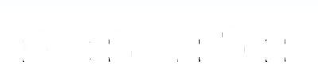

[Documentation](https://cyriacbr.github.io/react-split-text/)

This component lets you split your text, and wrap each line, word or letter with a custom element.
The lines and words are correctly split according to how they fit in the layout.
The component doesn't change that behavior, it justs analyze the text and wrap each line, word and letter in a custom element.
This lib is useful when trying to make text animations or special effects with texts.

## Features

* Zero-dependency 1.3 KB minified and gzipped
* Wrap your letters, words or lines with custom elements
* Respect and keep your layout integrity
* Readjust on resize
* Support dynamic text

## Installation

```bash
npm i @cyriacbr/react-split-text
# or
yarn add @cyriacbr/react-split-text
```

## Usage

To use this library, simply wrap your text with the `SplitText` component.
The text will automatically be wrapped, by default with `span` elements, and will be readjusted on resize.
You can inspect the bellow result to see how each line, word and letter are wrapped with a `span`.

```jsx
<SplitText>
  Hello World
</SplitText>
```

Everything else is covered in the [documentation](https://cyriacbr.github.io/react-split-text/).